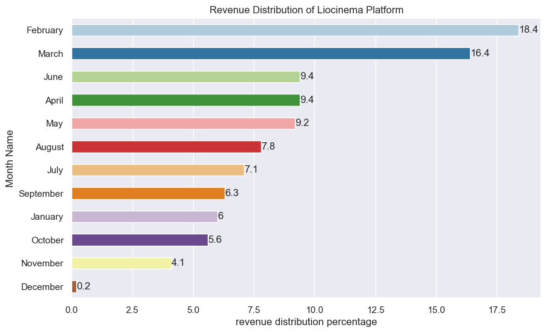

# Provide Insights for a Strategic Merger in the OTT Domain  

The project topic and questions were taken from a codebasic resume project challenge - https://codebasics.io/challenge/codebasics-resume-project-challenge

Tools used for data analysis were python, mysql, numpy and pandas. Matplotlib and seaborn modules for data visualization.
 
## Domain: Telecom & Streaming Services   |    Function: Strategy & Operations 
 
Lio, a leading telecommunications provider in India, is planning a strategic merger with Jotstar, one of the country’s most prominent streaming platforms. This potential partnership aims to combine LioCinema’s expansive subscriber base and Jotstar’s diverse content library to revolutionize digital streaming in India. 

As part of the merger preparation, the management team at Lio wants to analyse the 
performance and user behavior of both platforms—LioCinema and Jotstar—over the past 
one year (January to November 2024). The goal is to gain insights into individual platform performance, content consumption patterns, subscriber growth, Inactivity behavior, upgrade and downgrade trends. The insights derived from this study will help the management make informed decisions and optimize content strategies post-merger, with the ultimate goal of establishing Lio-Jotstar as the leading OTT platform in India.  
 
The management expects detailed insights into the following: 

1. *Content Library Analysis:* A detailed comparison of content types across both platforms.  
2. *Subscriber Insights:* Analyse trends in subscriber acquisition and demographic variations.   
3. *Inactivity Analysis:* Patterns of inactivity across age groups, city tiers, and subscription plans.    
4. *Upgrade Patterns:* Insights into subscription upgrades and their influencing factors.   
5. *Downgrade Patterns:* Analysis of subscription downgrades and associated trends.   
6. *Content Consumption Behavior:* Patterns in total watch time, device preferences, and variations by user demographics.   

# Questions used for detailed Insights

### Total Users & Growth Trends 
What is the total number of users for LioCinema and Jotstar, and how do they 
compare in terms of growth trends (January–November 2024) ? 

In Jotstar the is smaller increment in every month. While in Liocinema there is a huge increment in month of November.

 
### Content Library Comparison 
What is the total number of contents available on LioCinema vs. Jotstar? How do 
they differ in terms of language and content type ? 

In Joststar around 800 english language content is available and 637 Hindi language content.

In Liocinema around 424 Hindi language content is available and 242 Telugu language content.

**By Language**

**By Content Type**

Jotstar platform has more content type than Liocinema in term of movies, series and sports.

 

### User Demographics 
What is the distribution of users by age group, city tier, and subscription plan for each platform ? 

**User Demographics of Jotstar Platform**

**User Demographics of Liocinema Platform**

 
### Active vs. Inactive Users 
What percentage of LioCinema and Jotstar users are active vs. inactive? How do 
these rates vary by age group and subscription plan ? 

Since Jotstar platform has more number of entertainment contents to consume, around 85% are active users out of which 25-34 age groups are most active users. 

In Liocinema tho the content is less than Jotstar there are still 55% users who are active on the platform but around 45% are still inactive. Mostly around 18-24 age group are the ones who consume the content.

**Jotstar Platform**

<table border="1" class="dataframe">
  <thead>
    <tr style="text-align: right;">
      <th></th>
      <th>is_active</th>
      <th>Total Users</th>
      <th>Total Percentage</th>
    </tr>
  </thead>
  <tbody>
    <tr>
      <th>0</th>
      <td>Inactive Users</td>
      <td>6652</td>
      <td>15.0</td>
    </tr>
    <tr>
      <th>1</th>
      <td>Active Users</td>
      <td>37968</td>
      <td>85.0</td>
    </tr>
  </tbody>
</table>

 

**Liocinema Platform**

<table border="1" class="dataframe">
  <thead>
    <tr style="text-align: right;">
      <th></th>
      <th>is_active</th>
      <th>Total Users</th>
      <th>Total Percentage</th>
    </tr>
  </thead>
  <tbody>
    <tr>
      <th>0</th>
      <td>Inactive Users</td>
      <td>82305</td>
      <td>45.0</td>
    </tr>
    <tr>
      <th>1</th>
      <td>Active Users</td>
      <td>101141</td>
      <td>55.0</td>
    </tr>
  </tbody>
</table>

### Watch Time Analysis 
What is the average watch time for LioCinema vs. Jotstar during the analysis period?  How do these compare by city tier and device type ? 
 
Jotstar platform keep around 85% of average watch time while liocinema has 15% of average eatch time. The reason of less watch time in liocinema platform could be less contents availabiliy also most users who are active have enrolled themselves in Free subscription plan. 

Most users from both the platforms comes from Tier 1 city. Since it is an urban area, also mobile devices are on top to access contents on both of these devices. 

 

 

### Inactivity Correlation 
How do inactivity patterns correlate with total watch time or average watch time ? Are less engaged users more likely to become inactive ? 
 
 

<table border="1" class="dataframe">
  <thead>
    <tr style="text-align: right;">
      <th></th>
      <th>Platform</th>
      <th>Total Users</th>
      <th>Total Active Users</th>
      <th>Total Inactive Users</th>
      <th>Total Watch Time (mins) on Platform</th>
      <th>Watch Time (mins) Active Users</th>
      <th>Watch Time (mins) Inactive Users</th>
    </tr>
  </thead>
  <tbody>
    <tr>
      <th>0</th>
      <td>Jotstar</td>
      <td>44620</td>
      <td>37968</td>
      <td>6652</td>
      <td>21104.0</td>
      <td>23765.0</td>
      <td>5913.0</td>
    </tr>
    <tr>
      <th>1</th>
      <td>Liocinema</td>
      <td>183446</td>
      <td>101141</td>
      <td>82305</td>
      <td>3609.0</td>
      <td>5642.0</td>
      <td>1110.0</td>
    </tr>
  </tbody>
</table>

 
### Downgrade Trends 
How do downgrade trends differ between LioCinema and Jotstar? Are downgrades 
more prevalent on one platform compared to the other ? 
 
Downgrade rate is 6.15% in Jotstar which is less as compared to Liocinema having 11.37% . The reason for such a low downgrade rate can be a high number contents for users with different languages which is available and more number of users are of VIP, Premium Subcription plan.

 

<table border="1" class="dataframe">
  <thead>
    <tr style="text-align: right;">
      <th></th>
      <th>Platform</th>
      <th>Downgrades</th>
      <th>Total Users</th>
      <th>Downgrade Rate</th>
    </tr>
  </thead>
  <tbody>
    <tr>
      <th>0</th>
      <td>Jotstar</td>
      <td>2742</td>
      <td>44620</td>
      <td>6.15</td>
    </tr>
    <tr>
      <th>1</th>
      <td>Liocinema</td>
      <td>20859</td>
      <td>183446</td>
      <td>11.37</td>
    </tr>
  </tbody>
</table>

 
### Upgrade Patterns 
What are the most common upgrade transitions (e.g., Free to Basic, Free to VIP, 
Free to Premium) for LioCinema and Jotstar? How do these differ across platforms ? 
 
The same reasons as above can be given since Liocinema has less content available in their platform and mostly all users are having free subscription plan.

<table border="1" class="dataframe">
  <thead>
    <tr style="text-align: right;">
      <th></th>
      <th>Platform</th>
      <th>Upgrades</th>
      <th>Total Users</th>
      <th>Upgrade Rate</th>
    </tr>
  </thead>
  <tbody>
    <tr>
      <th>0</th>
      <td>Jotstar</td>
      <td>4348</td>
      <td>44620</td>
      <td>9.74</td>
    </tr>
    <tr>
      <th>1</th>
      <td>Liocinema</td>
      <td>4155</td>
      <td>183446</td>
      <td>2.26</td>
    </tr>
  </tbody>
</table>

### Paid Users Distribution 
How does the paid user percentage (e.g., Basic, Premium for LioCinema; VIP, 
Premium for Jotstar) vary across different platforms ? Analyse the proportion of 
premium users in Tier 1, Tier 2, and Tier 3 cities and identify any notable trends or differences. 
 
**Jotstar Piad Users Distribution**

<table border="1" class="dataframe">
  <thead>
    <tr style="text-align: right;">
      <th>subscription_plan</th>
      <th>Premium</th>
      <th>VIP</th>
      <th>Total User</th>
      <th>(VIP + Premium)</th>
      <th>Paid user %</th>
      <th>VIP Plan %</th>
      <th>Premium Plan %</th>
    </tr>
    <tr>
      <th>city_tier</th>
      <th></th>
      <th></th>
      <th></th>
      <th></th>
      <th></th>
      <th></th>
      <th></th>
    </tr>
  </thead>
  <tbody>
    <tr>
      <th>Tier 1</th>
      <td>10178</td>
      <td>10162</td>
      <td>25451</td>
      <td>20340</td>
      <td>79.92</td>
      <td>39.93</td>
      <td>39.99</td>
    </tr>
    <tr>
      <th>Tier 2</th>
      <td>2566</td>
      <td>6794</td>
      <td>13424</td>
      <td>9360</td>
      <td>69.73</td>
      <td>50.61</td>
      <td>19.12</td>
    </tr>
    <tr>
      <th>Tier 3</th>
      <td>623</td>
      <td>2201</td>
      <td>5745</td>
      <td>2824</td>
      <td>49.16</td>
      <td>38.31</td>
      <td>10.84</td>
    </tr>
  </tbody>
</table>

**Liocinema Paid Users Distribution**

<table border="1" class="dataframe">
  <thead>
    <tr style="text-align: right;">
      <th>subscription_plan</th>
      <th>Basic</th>
      <th>Premium</th>
      <th>Total User</th>
      <th>(Basic + Premium)</th>
      <th>Paid user %</th>
      <th>Basic Plan %</th>
      <th>Premium Plan %</th>
    </tr>
    <tr>
      <th>city_tier</th>
      <th></th>
      <th></th>
      <th></th>
      <th></th>
      <th></th>
      <th></th>
      <th></th>
    </tr>
  </thead>
  <tbody>
    <tr>
      <th>Tier 1</th>
      <td>12293</td>
      <td>10306</td>
      <td>41011</td>
      <td>22599</td>
      <td>55.10</td>
      <td>29.97</td>
      <td>25.13</td>
    </tr>
    <tr>
      <th>Tier 2</th>
      <td>22570</td>
      <td>9090</td>
      <td>63848</td>
      <td>31660</td>
      <td>49.59</td>
      <td>35.35</td>
      <td>14.24</td>
    </tr>
    <tr>
      <th>Tier 3</th>
      <td>18499</td>
      <td>5696</td>
      <td>78587</td>
      <td>24195</td>
      <td>30.79</td>
      <td>23.54</td>
      <td>7.25</td>
    </tr>
  </tbody>
</table>

### Revenue Analysis 
Assume the following monthly subscription prices, calculate the total revenue 
generated by both platforms (LioCinema and Jotstar) for the analysis period (January 
to November 2024).  

**Jotstar Revenue Analysis**

<table border="1" class="dataframe">
  <thead>
    <tr style="text-align: right;">
      <th></th>
      <th>Month Name</th>
      <th>Total Revenue</th>
      <th>revenue distribution percentage</th>
    </tr>
  </thead>
  <tbody>
    <tr>
      <th>9</th>
      <td>November</td>
      <td>7378635.0</td>
      <td>15.5</td>
    </tr>
    <tr>
      <th>10</th>
      <td>October</td>
      <td>6941410.0</td>
      <td>14.5</td>
    </tr>
    <tr>
      <th>11</th>
      <td>September</td>
      <td>6145362.0</td>
      <td>12.9</td>
    </tr>
    <tr>
      <th>1</th>
      <td>August</td>
      <td>5690712.0</td>
      <td>11.9</td>
    </tr>
    <tr>
      <th>5</th>
      <td>July</td>
      <td>4955398.0</td>
      <td>10.4</td>
    </tr>
    <tr>
      <th>6</th>
      <td>June</td>
      <td>4382184.0</td>
      <td>9.2</td>
    </tr>
    <tr>
      <th>8</th>
      <td>May</td>
      <td>3822220.0</td>
      <td>8.0</td>
    </tr>
    <tr>
      <th>0</th>
      <td>April</td>
      <td>3102156.0</td>
      <td>6.5</td>
    </tr>
    <tr>
      <th>7</th>
      <td>March</td>
      <td>2713479.0</td>
      <td>5.7</td>
    </tr>
    <tr>
      <th>3</th>
      <td>February</td>
      <td>1804066.0</td>
      <td>3.8</td>
    </tr>
    <tr>
      <th>4</th>
      <td>January</td>
      <td>744034.0</td>
      <td>1.6</td>
    </tr>
    <tr>
      <th>2</th>
      <td>December</td>
      <td>52068.0</td>
      <td>0.1</td>
    </tr>
  </tbody>
</table>

**Liocinema Revenue Analysis**

<table border="1" class="dataframe">
  <thead>
    <tr style="text-align: right;">
      <th></th>
      <th>Month Name</th>
      <th>Total Revenue</th>
      <th>revenue distribution percentage</th>
    </tr>
  </thead>
  <tbody>
    <tr>
      <th>3</th>
      <td>February</td>
      <td>4055232.0</td>
      <td>18.4</td>
    </tr>
    <tr>
      <th>7</th>
      <td>March</td>
      <td>3628449.0</td>
      <td>16.4</td>
    </tr>
    <tr>
      <th>6</th>
      <td>June</td>
      <td>2082330.0</td>
      <td>9.4</td>
    </tr>
    <tr>
      <th>0</th>
      <td>April</td>
      <td>2079612.0</td>
      <td>9.4</td>
    </tr>
    <tr>
      <th>8</th>
      <td>May</td>
      <td>2021850.0</td>
      <td>9.2</td>
    </tr>
    <tr>
      <th>1</th>
      <td>August</td>
      <td>1725576.0</td>
      <td>7.8</td>
    </tr>
    <tr>
      <th>5</th>
      <td>July</td>
      <td>1568742.0</td>
      <td>7.1</td>
    </tr>
    <tr>
      <th>11</th>
      <td>September</td>
      <td>1399869.0</td>
      <td>6.3</td>
    </tr>
    <tr>
      <th>4</th>
      <td>January</td>
      <td>1332276.0</td>
      <td>6.0</td>
    </tr>
    <tr>
      <th>10</th>
      <td>October</td>
      <td>1229460.0</td>
      <td>5.6</td>
    </tr>
    <tr>
      <th>9</th>
      <td>November</td>
      <td>905190.0</td>
      <td>4.1</td>
    </tr>
    <tr>
      <th>2</th>
      <td>December</td>
      <td>36576.0</td>
      <td>0.2</td>
    </tr>
  </tbody>
</table>

